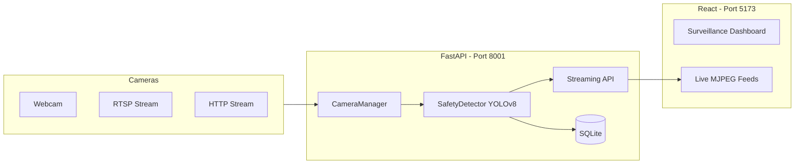

# 🦺 SafeGuard AI – Real-Time Enterprise Safety Platform

> A high-performance AI surveillance system for real-time worker safety monitoring, featuring multi-threaded YOLOv8 inference, MJPEG streaming, and a premium dark dashboard.


---

## 🛠️ Tech Stack

-   **AI Engine**: YOLOv8 (Ultralytics) for real-time object detection and PPE compliance.
-   **Backend**: FastAPI (Python 3.11+) with asynchronous multi-threaded camera management.
-   **Streaming**: MJPEG over HTTP (`multipart/x-mixed-replace`) for low-latency browser feeds.
-   **Frontend**: React 18, Vite, Tailwind CSS, Lucide React (Icons), Recharts (Analytics).
-   **Database**: SQLite with SQLAlchemy 2.0 (ORM) and Pydantic v2 (Schemas).
-   **Computer Vision**: OpenCV (cv2) for frame processing and JPEG encoding.

---

## 🏗️ Architecture



---

## 🚀 Quick Start (Local Dev)

### 1. Prerequisites
- Python 3.11+
- Node.js 20+
- `yolov8n.pt` (already in root folder)

### 2. Backend Setup
```bash
# From project root
cd backend
pip install -r requirements.txt

# Start backend (Run from project root!)
cd ..
uvicorn backend.app.main:app --reload --port 8001
```
-   **URL**: [http://localhost:8001](http://localhost:8001)
-   **API Docs**: [http://localhost:8001/docs](http://localhost:8001/docs)

### 3. Frontend Setup

```bash
# From project root
cd frontend
npm install
npm run dev
```
-   **URL**: [http://localhost:5173](http://localhost:5173)

---

## 🔐 Credentials (Default)
- **Admin Email**: `admin@safeguard.local`
- **Admin Password**: `admin1234`

---

## 📹 Adding a Camera
1. Log in to the Dashboard.
2. Navigate to **Camera Management**.
3. Click **Add Camera**.
    - **ID**: e.g., `webcam`
    - **Source**: `0` (local webcam) or `rtsp://...` or `http://...`

---

## 📸 API Streaming Endpoints
| Component | Endpoint | Description |
|---|---|---|
| **Live Stream** | `GET /api/cameras/{id}/stream` | MJPEG video with YOLO overlays |
| **Snapshots** | `/snapshots/{filename}.jpg` | Violation evidence screenshots |

---

## 📦 Features
- [x] **Real-Time Detection**: 15+ FPS with YOLOv8n.
- [x] **Multi-Camera**: Concurrent threaded capture.
- [x] **MJPEG Streaming**: Direct-to-browser live video.
- [x] **Premium Dark UI**: Monochromatic enterprise aesthetic.
- [x] **Violation Logging**: Auto-snap violation events to SQLite.
- [x] **Incident Analytics**: Time-series charts of safety trends.
- [x] **Dynamic Admin**: Live HUD with FPS/Violation counters.

---

## 📄 License
MIT – Built for enterprise safety demo and research.
s

| Role | Access |
|---|---|
| `admin` | Full access: add/remove cameras, delete violations, all APIs |
| `viewer` | Read-only: view dashboard, incidents, analytics |

---

## License

MIT – Built for demo/research use. See `LICENSE` for details.
